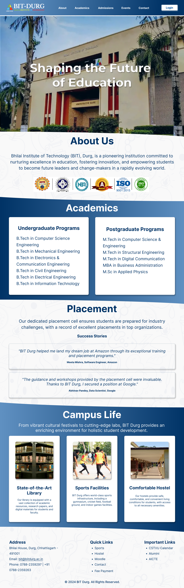

# NandanaMundakad-UI-UX-task-2

# BIT Durg Website Redesign

This repository contains the redesigned layout and components for the BIT Durg website. The goal of this redesign is to enhance user experience, improve visual aesthetics, and ensure responsiveness across all devices.

---

## 🖼 Project Preview

---

## 🔧 Project Overview

**Project Type:** Web Design Redesign  
**Tools Used:** Figma (Design)  
**Design Tools:** Figma for wireframes, mockups  
**Prototyping Tools:** Figma for interactive previews  

---

## 🌟 Key Features

### Visual Aesthetics
- **Clean and professional color palette** to align with the institution’s branding.
- **High-quality images** showcasing the campus, infrastructure, and facilities.
- **Modern typography** for a contemporary look.

### Improved Navigation
- **Structured navigation bar** for quick access to:
  - About
  - Academics
  - Admissions
  - Events
  - Contact
- Clearly visible **"Login" button** for easy user access.

### Responsive Design
- **Optimized layout** for desktops, tablets, and smartphones.
- **Dynamic adjustments** of grids and images for different screen sizes.

### Accessibility Compliance
- **Clear call-to-action buttons** with descriptive labels.

### Informative Content Sections
- Highlighted **achievements and accreditations**.
- Detailed **academic programs** and placement records.
- Dedicated space for **testimonials and success stories**.

---

## 📂 Dedicated Sections

### About Us
- Showcasing the institution's mission, vision, and history.

### Academics
- Comprehensive details of undergraduate and postgraduate programs.

### Placement
- Featuring success stories and the placement cell’s achievements.

### Campus Life
- Highlighting facilities, events, and vibrant campus culture.

### Testimonials
- Authentic student and alumni reviews to build trust and credibility.
